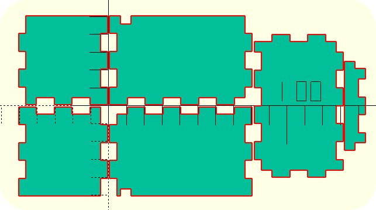

# Laser-boxpenscad

Laser-boxpenscad is a tool to generate box for laser cutting tools. It will create:
- 3D render of the box
- DXF files for laser cutter

It is wanted to be compatible with [gridfinity](https://gridfinity.xyz/) and support half-units (like my other project [eurogridfinity](https://github.com/ldevillez/eurogridfinity-openscad/tree/main))

## Generic features
- Customisable length, width and height
- Customisable material thickness
- Customisable notch length
- Label segment with adjustable length
- Removing notch less than material thickness
- Complete 2D layout

## Gridfinity
- Half unit for lenght and width
- Feet adaptation to the thickness of the material
- Choice of assembly with the feet:
  - Simple gluing
  - Gluing with some connector piece to help align
